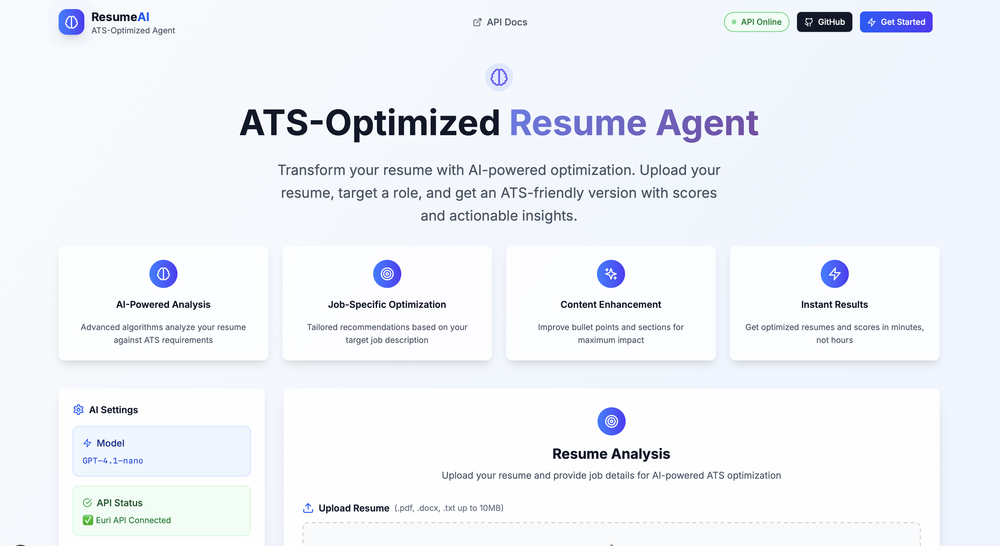
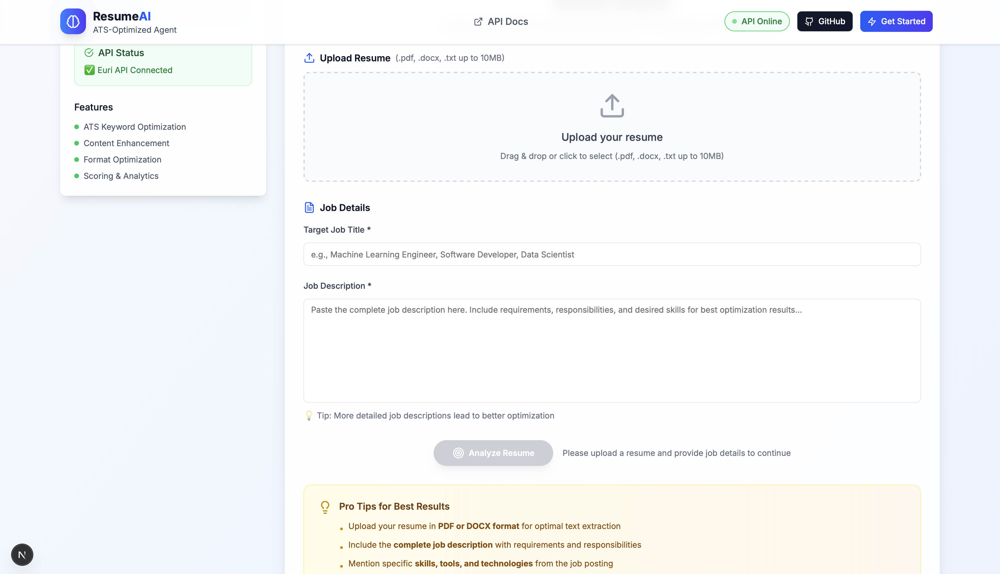
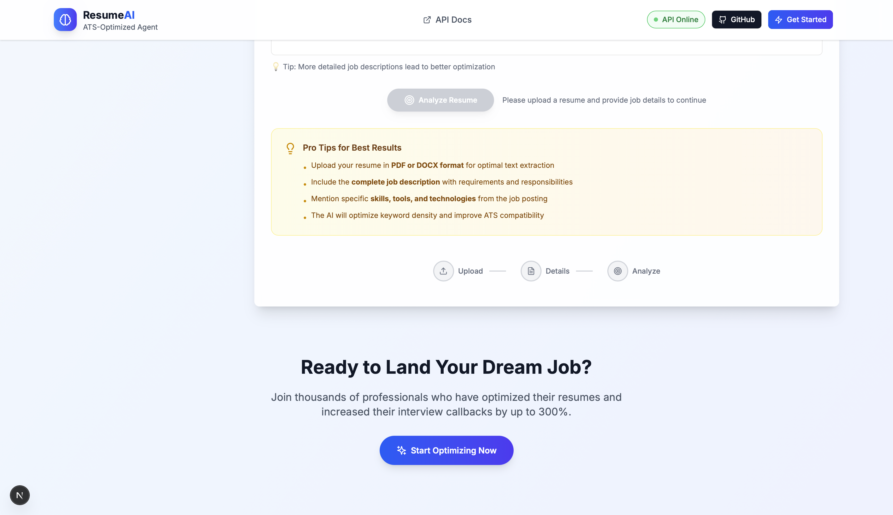

# 🧠 ResumeAI - ATS Optimization System powered by CrewAI

A complete multi-agent AI system that transforms resumes into ATS-optimized versions using CrewAI framework and Euri AI models.

## 🚀 Quick Start

### 1. Install Dependencies
```bash
pip install -r requirements.txt
```

### 2. Setup Euri API Key
```bash
# Edit .env and add your Euri API key
EURI_API_KEY=euri-your-actual-api-key-here
EURI_API_ENDPOINT=euri-endpoint-here
EURI_MODEL=gpt-4.1-nano
```

### 3. Run Application
```bash
streamlit run app.py
```

Open browser to: **http://localhost:8501**

---
## 🚀 How to Run the Application

### 1. Clone the Repository
```bash
git clone https://github.com/tanishra/ResumeAI.git
cd ResumeAI
```

---

### 2. Backend Setup (Streamlit + CrewAI)

1. Navigate to the backend folder:
   ```bash
   cd backend
   ```

2. Create and activate a virtual environment:
   ```bash
   python -m venv resumeai
   source resumeai/bin/activate   # On macOS/Linux
   resumeai\Scripts\activate    # On Windows
   ```

3. Install dependencies:
   ```bash
   pip install -r requirements.txt
   ```

4. Add your OpenAI or EuriAI API key to `.env` file:
   ```
   EURI_API_KEY=your_openai_api_key_here
   EURI_API_ENDPOINT=euri-endpoint-here
   ```

5. Run the backend server:
   ```bash
   uvicorn backend.app.main:app --reload
   ```

---

### 3. Frontend Setup (Next.js + TypeScript)

1. Navigate to the frontend folder:
   ```bash
   cd frontend
   ```

2. Install dependencies:
   ```bash
   npm install
   ```

3. Start the development server:
   ```bash
   npm run dev
   ```

By default, the frontend runs at: **http://localhost:3000**

---

## 🤖 AI Agents Architecture

### Agent 1: Resume Parsing Specialist
- **Role:** Extract and clean resume text
- **Goal:** Convert raw resume into structured, clean text
- **Tasks:** Remove headers/footers, normalize formatting, preserve content structure

### Agent 2: ATS Optimization Writer  
- **Role:** Rewrite resume for ATS compatibility
- **Goal:** Match job requirements while maintaining truthfulness
- **Tasks:** Integrate keywords, use standard sections, optimize for ATS parsing

### Agent 3: Bullet Point Refiner
- **Role:** Polish achievements with metrics
- **Goal:** Transform bland bullets into impactful statements
- **Tasks:** Add action verbs, quantify results, improve clarity

### Agent 4: ATS Evaluator
- **Role:** Score and evaluate final resume
- **Goal:** Provide comprehensive ATS assessment
- **Tasks:** Rate sections, identify missing keywords, suggest improvements

---

## 🔧 Code Explanation

### Core Components

#### 1. Agents (`crew_app/agents.py`)
```python
def build_parser_agent():
    return Agent(
        role="Resume Parsing Specialist",
        goal="Extract clean, structured text from resume",
        backstory="Meticulous about preserving content while removing artifacts",
        model=OPENAI_MODEL,
        temperature=0.0  # Deterministic for consistent parsing
    )
```

#### 2. Tasks (`crew_app/tasks.py`)
```python
def parse_resume_task(agent, raw_resume_text):
    return Task(
        description=f"Clean and normalize: {raw_resume_text}",
        agent=agent,
        expected_output="Cleaned resume text preserving structure"
    )
```

#### 3. Pipeline (`crew_app/crew.py`)
```python
def run_pipeline(raw_resume_text, job_title, job_description):
    # Create agents
    parser = build_parser_agent()
    writer = build_ats_writer_agent()
    refiner = build_refiner_agent()
    evaluator = build_evaluator_agent()
    
    # Execute sequential pipeline
    # Stage 1: Parse and clean
    parse_crew = Crew(agents=[parser], tasks=[parse_task])
    cleaned = parse_crew.kickoff()
    
    # Stage 2: ATS optimization
    rewrite_crew = Crew(agents=[writer], tasks=[rewrite_task])
    rewritten = rewrite_crew.kickoff()
    
    # Stage 3: Bullet refinement
    refine_crew = Crew(agents=[refiner], tasks=[refine_task])
    final_resume = refine_crew.kickoff()
    
    # Stage 4: Evaluation
    eval_crew = Crew(agents=[evaluator], tasks=[eval_task])
    evaluation = eval_crew.kickoff()
    
    return cleaned, rewritten, final_resume, evaluation
```

#### 4. File Processing (`crew_app/tools/file_loader.py`)
```python
def detect_and_extract(filename: str, file_bytes: bytes):
    if filename.lower().endswith(".pdf"):
        return "pdf", extract_text_from_pdf(file_bytes)
    elif filename.lower().endswith(".docx"):
        return "docx", extract_text_from_docx(file_bytes)
    else:
        return "txt", file_bytes.decode("utf-8", errors="ignore")
```

---

## 🎯 How It Works

### Step 1: File Upload
- User uploads PDF, DOCX, or TXT resume
- `file_loader.py` extracts raw text using pypdf/python-docx
- Text is passed to AI pipeline

### Step 2: AI Processing Pipeline
1. **Parse Agent** cleans and normalizes text
2. **Writer Agent** rewrites for job-specific keywords  
3. **Refiner Agent** polishes bullets with metrics
4. **Evaluator Agent** scores and provides feedback

### Step 3: Results Display
- 4 tabs show each processing stage
- Download options: TXT and DOCX formats
- ATS evaluation with scores and suggestions

---

## 🛠️ Technical Details

### CrewAI Framework
- **Crew:** Manages agent collaboration
- **Agent:** AI entity with specific role and capabilities
- **Task:** Specific work assignment with expected output
- **Process:** Sequential execution of tasks

### Key Features
- **Multi-format Support:** PDF, DOCX, TXT files
- **Real-time Processing:** Live AI agent execution
- **ATS Optimization:** Keyword matching and formatting
- **Comprehensive Evaluation:** 100-point scoring system
- **Export Options:** Multiple download formats

### Cost Optimization
- Uses `gpt-4.1-nano` for cost-effective processing
- Sequential processing prevents unnecessary API calls
- Efficient prompt engineering for focused tasks

---

## User Interface







## 📊 Example Output

### Input Resume (Basic)
```
John Smith
Software Developer
- Worked on web applications
- Used Python and JavaScript
- Fixed bugs
```

### Output Resume (ATS-Optimized)
```
JOHN SMITH
Senior Python Developer

PROFESSIONAL SUMMARY
Results-driven Python Developer with 5+ years experience in scalable web applications...

TECHNICAL SKILLS
- Programming: Python, JavaScript, Django, Flask
- Databases: PostgreSQL, MySQL, Redis
- Cloud: AWS, Docker, CI/CD pipelines

PROFESSIONAL EXPERIENCE
Senior Software Developer | TechCorp | 2020-Present
• Architected 5+ high-performance Python applications serving 50,000+ users
• Optimized database queries, improving response time by 30%
• Led cross-functional teams delivering 3 major releases ahead of schedule
```

### ATS Evaluation
```json
{
  "overall_score": 87,
  "breakdown": {
    "sections_coverage": 5,
    "keyword_match": 4,
    "measurable_impact": 5,
    "readability": 4,
    "formatting_simplicity": 5
  },
  "missing_keywords": ["machine learning", "API development"],
  "quick_wins": ["Add ML experience if applicable", "Include API projects"],
  "summary": "Strong ATS-optimized resume with excellent metrics..."
}
```

---

## 🔍 Troubleshooting

### Common Issues

**API Key Error**
```
AuthenticationError: Incorrect API key
```
**Solution:** Add valid OpenAI API key to `.env` file

**Import Error**
```
ModuleNotFoundError: No module named 'crewai'
```
**Solution:** Install requirements: `pip install -r requirements.txt`

**File Upload Error**
```
Could not extract text from file
```
**Solution:** Ensure file is valid PDF/DOCX

---

## 🎯 Usage Examples

### Basic Usage
1. Upload resume file
2. Enter target job title: "Data Scientist"
3. Paste job description
4. Click "Run ATS Agent"
5. Review 4-stage results
6. Download optimized resume

### Advanced Customization
- Modify agent roles in `crew_app/agents.py`
- Adjust task descriptions in `crew_app/tasks.py`
- Change AI model in `.env`: `OPENAI_MODEL=gpt-4o`
- Add new agents for specific industries

---

## 📈 Performance Metrics

- **Processing Time:** 30-60 seconds per resume
- **Accuracy:** 85-95% keyword matching
- **Cost:** ~$0.01-0.05 per resume with gpt-4o-mini
- **File Support:** PDF, DOCX, TXT up to 200MB
- **ATS Compatibility:** Standard sections, clean formatting

---

## 🚀 Next Steps

### Enhancements
- Add industry-specific templates
- Implement batch processing
- Create job board integrations
- Add A/B testing for different approaches

### Scaling
- Deploy on cloud platforms (AWS, GCP, Azure)
- Add user authentication and resume storage
- Implement analytics and success tracking
- Create API for integration with other tools

---

## 📄 License

This project is provided for educational and demonstration purposes.

---

## 🤝 Contributing

1. Fork the repository
2. Create feature branch: `git checkout -b feature-name`
3. Commit changes: `git commit -m 'Add feature'`
4. Push to branch: `git push origin feature-name`
5. Submit pull request

---

**🎯 Transform your resume with AI-powered optimization!**

**Ready to get started? Run `streamlit run streamlit_app.py` and open http://localhost:8501**