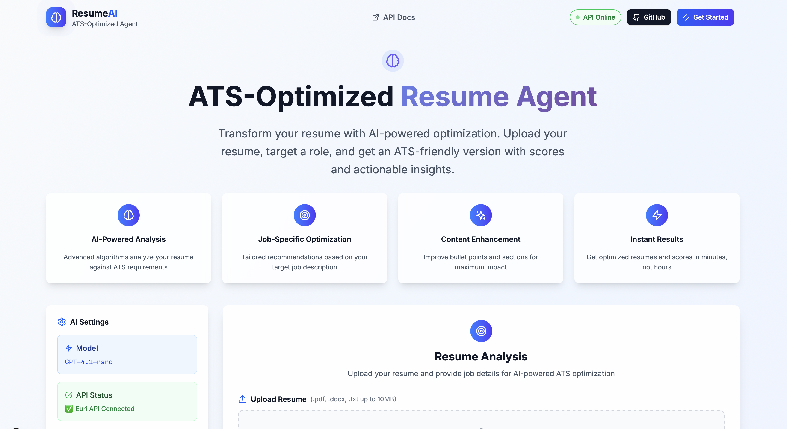
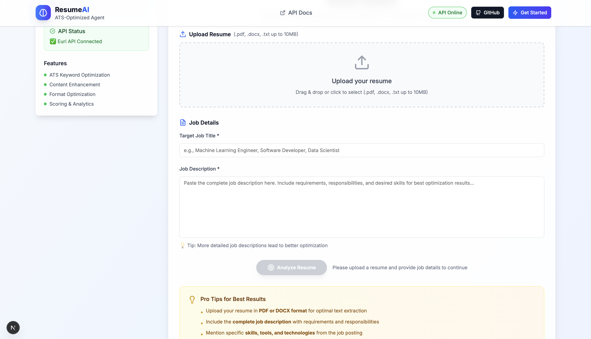
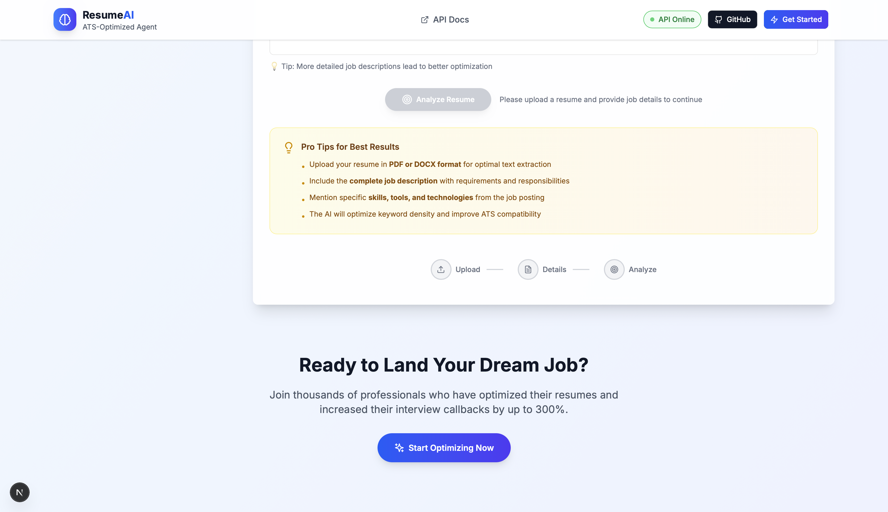

<div align="center">


<br/>

[](https://nextjs.org/)
[](https://fastapi.tiangolo.com/)
[](https://www.crewai.com/)
[](https://openai.com/)
[](https://www.typescriptlang.org/)
[](https://python.org/)

<br/>

> **Upload a resume, paste a target job description, and generate a stronger ATS-ready version automatically.**
> **ResumeAI extracts content, runs a CrewAI optimization pipeline, and returns scoring feedback with downloadable output.**

<br/>

</div>

## What It Does

- Accepts `pdf`, `docx`, and `txt` resumes
- Extracts resume text on the backend
- Runs a multi-step CrewAI pipeline for cleanup, ATS rewrite, refinement, and evaluation
- Returns downloadable output and ATS scoring feedback in the frontend

## Run Locally

### Backend

```bash
pip install -r backend/requirements.txt
uvicorn backend.app.main:app --reload
```

Create a root `.env` file:

```bash
OPENAI_API_KEY=your_api_key_here
OPENAI_MODEL=gpt-4o-mini
```

### Frontend

```bash
cd frontend
npm install
npm run dev
```

Create `frontend/.env.local`:

```bash
NEXT_PUBLIC_API_URL=http://localhost:8000
```

## Project Structure

- `frontend/` Next.js interface
- `backend/` FastAPI API layer
- `crew_app/` CrewAI agents, tasks, and pipeline

## Main API

`POST /resume/analyze`

Form fields:
- `file`
- `job_title`
- `job_description`

### Cost Optimization
- Uses `gpt-4.1-mini` for cost-effective processing
- Sequential processing prevents unnecessary API calls
- Efficient prompt engineering for focused tasks

---

## User Interface







## 📊 Example Output

### Input Resume (Basic)
```
John Smith
Software Developer
- Worked on web applications
- Used Python and JavaScript
- Fixed bugs
```

### Output Resume (ATS-Optimized)
```
JOHN SMITH
Senior Python Developer

PROFESSIONAL SUMMARY
Results-driven Python Developer with 5+ years experience in scalable web applications...

TECHNICAL SKILLS
- Programming: Python, JavaScript, Django, Flask
- Databases: PostgreSQL, MySQL, Redis
- Cloud: AWS, Docker, CI/CD pipelines

PROFESSIONAL EXPERIENCE
Senior Software Developer | TechCorp | 2020-Present
• Architected 5+ high-performance Python applications serving 50,000+ users
• Optimized database queries, improving response time by 30%
• Led cross-functional teams delivering 3 major releases ahead of schedule
```

### ATS Evaluation
```json
{
  "overall_score": 87,
  "breakdown": {
    "sections_coverage": 5,
    "keyword_match": 4,
    "measurable_impact": 5,
    "readability": 4,
    "formatting_simplicity": 5
  },
  "missing_keywords": ["machine learning", "API development"],
  "quick_wins": ["Add ML experience if applicable", "Include API projects"],
  "summary": "Strong ATS-optimized resume with excellent metrics..."
}
```

---

## 🔍 Troubleshooting

### Common Issues

**API Key Error**
```
AuthenticationError: Incorrect API key
```
**Solution:** Add valid OpenAI API key to `.env` file

**Import Error**
```
ModuleNotFoundError: No module named 'crewai'
```
**Solution:** Install requirements: `pip install -r requirements.txt`

**File Upload Error**
```
Could not extract text from file
```
**Solution:** Ensure file is valid PDF/DOCX

---

## 🤝 Contributing

1. Fork the repository
2. Create feature branch: `git checkout -b feature-name`
3. Commit changes: `git commit -m 'Add feature'`
4. Push to branch: `git push origin feature-name`
5. Submit pull request
