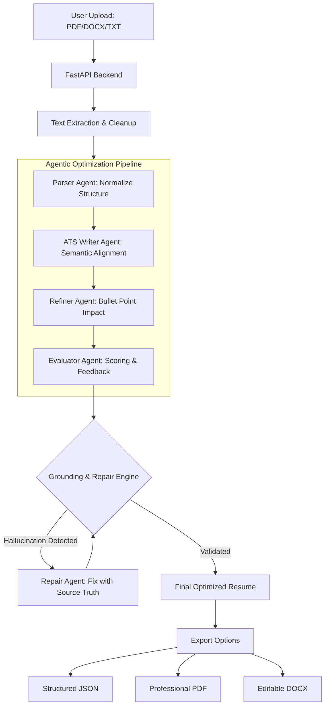

<div align="center">


<br/>

[](https://nextjs.org/)
[](https://fastapi.tiangolo.com/)
[](https://openai.com/)
[](https://www.langchain.com/)
[](https://www.typescriptlang.org/)
[](https://python.org/)

<br/>

> **Upload a resume, paste a target job description, and generate a stronger ATS-ready version automatically.**
> **ResumeAI extracts content, runs a staged OpenAI-powered agentic optimization pipeline, validates grounding to prevent hallucinations, and returns scoring feedback with downloadable output.**

<br/>

</div>

## What It Does

- **Intelligent Extraction**: Accepts `pdf`, `docx`, and `txt` resumes and extracts text with high fidelity.
- **Agentic Pipeline**: Runs a four-stage LLM pipeline (Parser, Writer, Refiner, Evaluator) for comprehensive optimization.
- **Grounded AI & Repair Engine**: A dedicated validation pass that cross-references AI claims against the source document. It automatically repairs hallucinations or reverts to original factual data.
- **Real-Time Streaming**: Uses Server-Sent Events (SSE) to provide live status updates as the pipeline processes each stage.
- **Multi-Format Export**: Returns downloadable optimized resumes in professional PDF and DOCX formats, along with structured JSON feedback.

## Architecture


```mermaid
graph TD
    A[User Upload: PDF/DOCX/TXT] --> B[FastAPI Backend]
    B --> C[Text Extraction & Cleanup]
    C --> D[Agentic Optimization Pipeline]
    
    subgraph D [Agentic Optimization Pipeline]
        D1[Parser Agent: Normalize Structure] --> D2[ATS Writer Agent: Semantic Alignment]
        D2 --> D3[Refiner Agent: Bullet Point Impact]
        D3 --> D4[Evaluator Agent: Scoring & Feedback]
    end
    
    D4 --> E{Grounding & Repair Engine}
    E -- Hallucination Detected --> F[Repair Agent: Fix with Source Truth]
    F --> E
    E -- Validated --> G[Final Optimized Resume]
    
    G --> H[Export Options]
    H --> H1[Structured JSON]
    H --> H2[Professional PDF]
    H --> H3[Editable DOCX]
```

## How It Actually Works

ResumeAI leverages a deterministic verification pipeline to preserve 100% of your professional truth while bridging the gap with recruitment algorithms.

The active backend flow is:

1. **Upload & Extract**: File is uploaded to FastAPI; text is extracted from PDF, DOCX, or TXT.
2. **Staged Execution**: Four specialized agents process the data sequentially:
   - **Parser Agent**: Normalizes formatting and removes noise.
   - **ATS Writer Agent**: Strategically aligns keywords and experience with job requirements.
   - **Refiner Agent**: Strengthens bullet points using high-impact metrics and phrasing.
   - **Evaluator Agent**: Scores the resume and provides actionable improvement recommendations.
3. **Grounding Validation**: Rewritten output is validated against the source resume to catch unsupported dates, metrics, tools, or credentials.
4. **Self-Correction**: The system retries with repair prompts when discrepancies are found, ensuring the final output is both optimized and honest.
5. **Output Generation**: Results are normalized to JSON and rendered into downloadable formats.

This is a robust, staged agentic pipeline built for high-stakes engineering roles.

## Run Locally

### Backend

```bash
pip install -r backend/requirements.txt
uvicorn backend.app.main:app --reload
```

Create a root `.env` file:

```bash
OPENAI_API_KEY=your_api_key_here
OPENAI_MODEL=gpt-4o-mini
```

Run backend tests:

```bash
env UV_CACHE_DIR=/tmp/uv-cache uv run python backend/run_tests.py
```

### Frontend

```bash
cd frontend
npm install
npm run dev
```

Create `frontend/.env.local`:

```bash
NEXT_PUBLIC_API_URL=http://localhost:8000
```

Run frontend tests:

```bash
npm --prefix frontend test
```

## Project Structure

- `frontend/` Next.js interface
- `backend/` FastAPI API layer
- `crew_app/` staged LLM pipeline, prompts, and file utilities
- `app.py` legacy Streamlit interface

## Main API

`POST /resume/analyze`

Form fields:
- `file`
- `job_title`
- `job_description`

### Runtime Notes
- Defaults to `gpt-4o-mini` unless `OPENAI_MODEL` is overridden
- Uses sequential stage execution to keep prompts focused and isolate failures
- Adds grounding validation and evaluation normalization to reduce unsafe or malformed output

---

## User Interface


## 📊 Example Output

### Input Resume (Basic)
```
John Smith
Software Developer
- Worked on web applications
- Used Python and JavaScript
- Fixed bugs
```

### Output Resume (ATS-Optimized)
```
JOHN SMITH
Senior Python Developer

PROFESSIONAL SUMMARY
Results-driven Python Developer with 5+ years experience in scalable web applications...

TECHNICAL SKILLS
- Programming: Python, JavaScript, Django, Flask
- Databases: PostgreSQL, MySQL, Redis
- Cloud: AWS, Docker, CI/CD pipelines

PROFESSIONAL EXPERIENCE
Senior Software Developer | TechCorp | 2020-Present
• Architected 5+ high-performance Python applications serving 50,000+ users
• Optimized database queries, improving response time by 30%
• Led cross-functional teams delivering 3 major releases ahead of schedule
```

### ATS Evaluation
```json
{
  "overall_score": 87,
  "breakdown": {
    "sections_coverage": 5,
    "keyword_match": 4,
    "measurable_impact": 5,
    "readability": 4,
    "formatting_simplicity": 5
  },
  "missing_keywords": ["machine learning", "API development"],
  "quick_wins": ["Add ML experience if applicable", "Include API projects"],
  "summary": "Strong ATS-optimized resume with excellent metrics..."
}
```

---

## Troubleshooting

### Common Issues

**API Key Error**
```
AuthenticationError: Incorrect API key
```
**Solution:** Add valid OpenAI API key to `.env` file

**Test Runner Plugin Error**
```bash
TypeError: ForwardRef._evaluate() missing 1 required keyword-only argument: 'recursive_guard'
```
**Solution:** Use the repo-backed runner `env UV_CACHE_DIR=/tmp/uv-cache uv run python backend/run_tests.py`, which disables third-party pytest plugin autoload before importing pytest.

**File Upload Error**
```
Could not extract text from file
```
**Solution:** Ensure file is valid PDF/DOCX

---

## 🤝 Contributing

1. Fork the repository
2. Create feature branch: `git checkout -b feature-name`
3. Commit changes: `git commit -m 'Add feature'`
4. Push to branch: `git push origin feature-name`
5. Submit pull request
